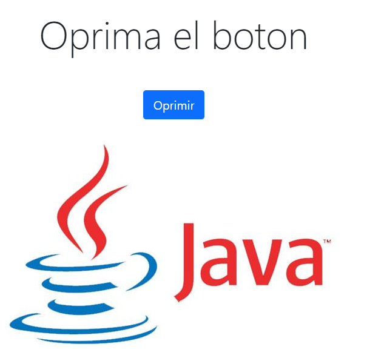
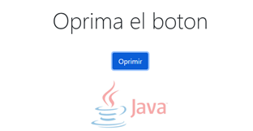

# Taller Clientes y Servicios                 
Haciendo uso Java, Maven y Git y Heroku se desarrollaron los siguientes retos:
## Reto 1
Escriba un servidor web que soporte múlltiples solicitudes seguidas (no concurrentes). El servidor debe retornar todos los archivos solicitados, incluyendo páginas html e imágenes. Construya un sitio web con javascript para probar su servidor. Despliegue su solución en Heroku. NO use frameworks web como Spark o Spring use solo Java y las librerías para manejo de la red.
## Reto 2 (AVANZADO)
Usando su  servidor y java (NO use frameworks web como Spark o Spring). Escriba un framework similar a Spark que le permita publicar servicios web "get" con funciones lambda y le permita acceder a recursoso estáticos como páginas, javascripts, imágenes, y CSSs. Cree una aplicación que conecte con una base de datos desde el servidor para probar su solución. Despliegue su solución en Heroku.
## Comenzando
Para obtener una copia del proyecto en nuestra máquina local y podamos realizar tareas de desarrollo, pruebas o ejecuciones debemos clonarlo utilizando el siguiente comando:
```
git clone https://github.com/germanAOQ/AREP-3-ClientesYServicios.git
```
### Pre-requisitos
Para hacer uso del software es necesario tener instalado:
* Maven: Automatiza y estandariza el flujo de vida de la construcción de software.                 
    Siga las instrucciones en http://maven.apache.org/download.cgi#Installation
* Git: Administrador descentralizado de configuraciones.                     
    Siga las instrucciones en http://git-scm.com/book/en/v2/Getting-Started-Installing-Git
* Toolbelt de Heroku: Paquete de la CLI de Heroku
    Siga las instrucciones en https://devcenter.heroku.com/articles/heroku-cli
### Instalación
Una vez clonado el proyecto, en la carpeta donde hayamos hecho el procedimiento, abrimos la shell del sistema operativo en la que estemos y accedemos al directorio de este
```
cd AREP-2-IntroduccionHeroku
```
Ejecutamos la fase **package**, la cual ejecutara las fases previas del ciclo de vida: **validate, compile y test** y empaquetará el código ya compilado en un formato que se le haya especificado en el archivo de configuración, POM.xml
```
mvn package
```
#### Reto 1
Para ejecutar el primer reto se debe utilizar el siguiente comando, cabe resaltar que este comando se ejecuta en un sistema operativo Windows y haciendo uso de PowerShell
```
java $JAVA_OPTS -cp target/classes:target/dependency/* edu.escuelaing.arep.httpserver.runningserver.RunningServer
```
Una vez hecha la ejecución, se podrá acceder a la aplicación localmente através de la siguiente dirección:
```
http://localhost:36000/index.html
```
Además, se podrá visualizar unicamente la imagen (javaLogo.jpg) accediendo a:
```
http://localhost:36000/javaLogo.jpg
```
Para realizar la ejecucución del reto en heroku se debe tener la siguiente configuración en el Procfile:
```
web: java $JAVA_OPTS -cp target/classes:target/dependency/* edu.escuelaing.arep.httpserver.runningserver.RunningServer
```
#### Reto 2
Para ejecutar el segundo reto se debe utilizar el siguiente comando, cabe resaltar que este comando se ejecuta en un sistema operativo Windows y haciendo uso de PowerShell
```
java $JAVA_OPTS -cp target/classes:target/dependency/* edu.escuelaing.arep.nanosparkweb.controller.NanoSparkWebController
```
Una vez hecha la ejecución, se podrá acceder a la aplicación localmente através de la siguiente dirección:
```
http://localhost:36000/
```
Para realizar la ejecucución del reto en heroku se debe tener la siguiente configuración en el Procfile:
```
web: java $JAVA_OPTS -cp target/classes:target/dependency/* edu.escuelaing.arep.nanosparkweb.controller.NanoSparkWebController
```
## Pruebas
Se presentan dos pruebas, una por cada reto:

### Reto 1:
En el primer reto, una vez abierto el link, se ve lo siguiente en el cliente:

Si se oprime el botón, la imagen desaparecerá:

## Documentación

### Generar documentación
Para generar la documentación se debe agregar al código del archivo de configuración de Maven, POM.xml, el siguiente plugin:
```
<plugin>
	<groupId>org.apache.maven.plugins</groupId>
	<artifactId>maven-javadoc-plugin</artifactId>
	<executions>
		<execution>
			<id>attach-javadocs</id>
			<goals>
				<goal>jar</goal>
			</goals>
		</execution>
	</executions>
</plugin>

```
Uno vez agregado el plugin anterior, se ejecuta el siguiente comando para generar el javadoc
```
mvn install
```
Finalmente, en la carpeta target quedará creado un archivo con el nombre **apidocs**, lugar en donde se encontrará la documentación.

## Construido con 
* [Maven](https://maven.apache.org/) - Manejador de dependencias
* [Git](https://github.com/) - Control de versionamiento
* [Heroku](https://heroku.com) - Plataforma de despliegue [](https://sparkwebapp.herokuapp.com/)
* [Circle CI]() - Integración Continua [](https://circleci.com/gh/circleci/circleci-docs)

## Autores 
* [Germán Andrés Ospina Quintero](https://github.com/germanAOQ)

## Licencia 📄
Este proyecto esta licenciado por GNU General Public License v3.0
